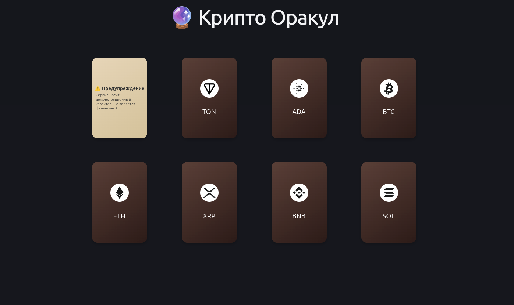
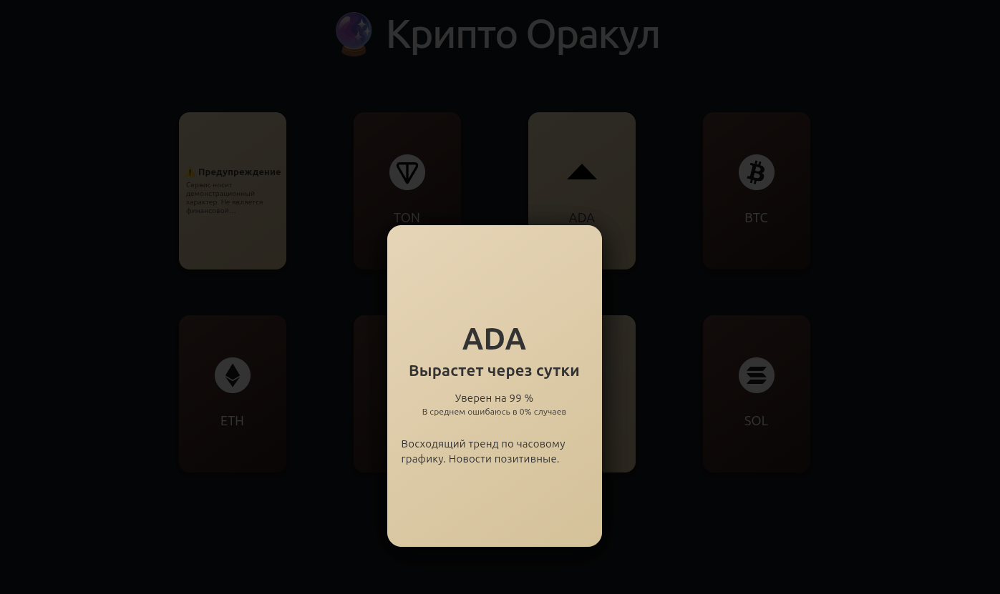

# 🔮 Market Oracle

Крипто-оракул для предсказания движения цены на основе технических индикаторов и новостного сентимента.
Состоит из двух сервисов: **[frontend](frontend/README.md)** (React/Vite) и **[backend](backend/README.md)** (Python/FastAPI).

## 🚀 Быстрый старт

```bash
cp .env.example .env
touch db.sqlite3
mkdir weights
docker compose up -d --build
```
Для работы системы необходима предварительная тренировка модели. (Создание scaler и default coef/weights).
Без этого шага система не сможет составлять прогноз.


- **Frontend**: http://localhost
- **Backend API**: http://localhost/api/
- **Swagger**: http://localhost/docs

## ⚙️ Переменные окружения

Создай `.env` в корне проекта:

```bash
# Токены для прогноза (JSON array).
# Принятые наименования токенов
# Посмотреть например тут: https://www.binance.com/ru/markets/overview
TOKENS='["BTC", "ETH", "BNB", "SOL"]'

# Новости (NewsAPI) 
# Получить api key можно тут: https://newsapi.org/
NEWS_API_KEY=your-api-key
# Если с api проблемы то можно включить мок на новости
# Мок включен по умолчанию, поэтому его надо обязательно отключить при использовании новостного api
NEWS_FAKER=True
# Сколько времени действует прогноз, прежде чем система его обновит
FRESH_DELTA_MINUTES: int = 60
```

> ⚠️ У newsapi.org в бесплатной версии есть ограничение на 100 запросов в день
> Может потребоваться VPN для корректной работы

## 🏋️‍♀️ Предтренировка модели


```bash
docker compose exec backend python -m src.warmup collect
docker compose exec backend python -m src.warmup train
```

Справка по скрипту: `docker compose exec backend python -m src.warmup -h`


## 🏋️ Дотренировка модели

Как только накопилось 5 новых прогнозов система сама дотренируется. Проверка выполнятся после каждого составления нового прогноза.

---

> 📖 Детали по сервисам: [backend/README.md](backend/README.md), [frontend/README.md](frontend/README.md)

---

## 🖼️ Скриншоты интерфейса





---


## 📋 Что сделано

Система предсказания направления движения цены криптовалюты на основе:
- **Технического анализа** — нормализованная скользящая средняя (MA) по свечам 1H
- **Новостного сентимента** — полярность и субъективность новостных статей через NLP
- **Машинного обучения** — онлайн-модель SGDClassifier с поддержкой дообучения (partial_fit)

**Ключевые возможности:**
- Автоматический сбор цен (Binance/CCXT) и новостей (NewsAPI / мок)
- Генерация прогноза по запросу через API
- Автодообучение модели, когда накопилось ≥5 непроверенных прогнозов
- Хранение сырых данных и метрик для каждого прогноза
- Оценка точности (error ratio) и вклад каждого признака (contributions)

**Frontend:**
- Интерфейс реализован на **React + TypeScript + Vite**
- Дизайн и анимации сгенерированы с помощью AI

---

## 🏗️ Архитектура

```
┌──────────────┐         ┌──────────────────┐         ┌─────────────┐
│   Frontend   │────────▶│     Backend      │────────▶│  Binance    │
│  React/Vite  │  HTTP   │  FastAPI + uvicorn│  CCXT   │   (prices)  │
└──────────────┘         └──────────────────┘         └─────────────┘
                              │    │    │
                              │    │    └──▶ NewsAPI / FakeNews
                              │    │
                              │    └────────▶ SQLite (DB)
                              │
                              └────────────▶ .joblib (модели)
```

**Поток данных при запросе прогноза:**

1. GET `/api/tokens/{token}` → проверка, есть ли свежий прогноз (за последний час)
2. **Если нет:**
   - Загрузка OHLCV-свечей 1H через CCXT (Binance)
   - Загрузка новостей через NewsAPI (или мок)
   - Вычисление: `price_ma_ratio` (цена / MA), `news_polarity`, `news_subjectivity`
   - Прогноз через модель → сохранение в БД + сырые данные в `raw_data`
3. Возврат: прогноз + error_ratio + feature contributions
4. **Фоновая задача:** если ≥5 непроверенных прогнозов → дообучение модели

**Сервисы:**

| Компонент | Стек | Описание |
|-----------|------|----------|
| Frontend | React + Vite + TypeScript + Bootstrap | Веб-интерфейс |
| Backend | Python 3 + FastAPI + uvicorn | REST API, логика прогнозов |
| ML | scikit-learn (SGDClassifier) | Онлайн-классификация направления цены |
| DB | SQLite + SQLAlchemy async + SQLModel | Хранение прогнозов, сырых данных, источников |
| Цена | ccxt (Binance) | OHLCV-данные с таймфреймом 1H |
| Новости | NewsAPI / TextBlob (мок) | Сентимент-анализ статей |

---

## 💾 Где хранятся данные

### База данных (db.sqlite3)

| Таблица | Описание |
|---------|----------|
| `forecasts` | Прогнозы: токен, цена, target, confidence, метрики признаков, флаг обученности |
| `raw_data` | Сырые JSON-пейлоады: OHLCV-свечи и тексты новостей, привязанные к прогнозам |
| `sources` | Метаданные источников данных (id, type, url) |

### Файлы моделей (weights/)

| Файл | Описание |
|------|----------|
| `global_scaler.joblib` | Общий StandardScaler для всех моделей |
| `{token}.joblib` | Модель SGDClassifier для конкретного токена |
| `default.joblib` | Фолбэк-модель, если модель токена не найдена |

### docker-compose volumes

| Bind-mount | Куда мапится в контейнере |
|------------|--------------------------|
| `./db.sqlite3` | `/app/db.sqlite3` |
| `./weights` | `/app/weights` |

---

## 🤖 AI / ML Stack

Использованные технологии и библиотеки:

| Библиотека | Назначение |
|------------|-----------|
| **scikit-learn** — SGDClassifier с `log_loss` | Основная модель классификации (вверх/вниз) |
| **scikit-learn** — `StandardScaler` | Нормализация признаков (глобальная, на всю историю) |
| **TextBlob** | Sentiент-анализ новостных заголовков/описаний (polarity + subjectivity) |
| **partial_fit** | Онлайн-дообучение модели по мере накопления подтверждённых прогнозов |

> 📝 Форматы данных.

### Признаки (features)

1. **price_ma_ratio** — `close_price / moving_average` (n свечей). >1 → бычий сигнал, <1 → медвежий
2. **news_polarity** — средняя полярность новостей от TextBlob (от -1 до 1)
3. **news_subjectivity** — средняя субъективность новостей от TextBlob (от 0 до 1)

### Дообучение

- Запускается автоматически после каждого нового прогноза (фоновая задача)
- Требует ≥5 непроверенных прогнозов с возможностью получения `actual`, проверяется по дате текущей и составления прогноза
- `actual` определяется как сравнение фактической цены через 1 день с ценой прогноза (1 - вверх, 0 - вниз, не вверх)
- Модели для каждого токена обучаются изолированно, на этапе дообучения, начальная модель для всех `default`
